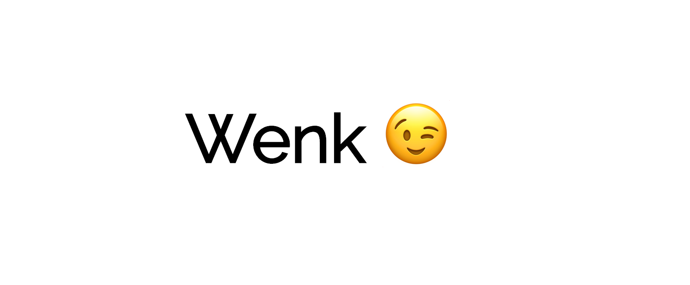

<div align="center">
	
</div>
<br>
<div align="center">
	Lightweight pure CSS tooltip for the greater good
</div>
<br>
<div align="center">
  <a href="https://npmjs.org/package/wenk">
    
  </a>
  <a href="https://badge.fury.io/bo/wenk">
    
  </a>
  <a href="https://npmjs.org/package/wenk">
  
  </a>
  <a href="https://github.com/feross/standard">
    
  </a>
  <a href="https://travis-ci.org/tiaanduplessis/wenk">
    
  </a>
  <a href="https://github.com/RichardLitt/standard-readme)">
    
  </a>
  <a href="https://badge.fury.io/gh/tiaanduplessis%2Fwenk">
    
  </a>
  <a href="https://dependencyci.com/github/tiaanduplessis/wenk">
    
  </a>
  <a href="https://github.com/tiaanduplessis/wenk/blob/master/other/LICENSE">
    
  </a>
  <a href="http://makeapullrequest.com">
    
  </a>
  <a href="https://www.paypal.me/tiaanduplessis/1">
    
  </a>
</div>
<br>
<div align="center">
  <a href="https://github.com/tiaanduplessis/wenk/watchers">
    
  </a>
  <a href="https://github.com/tiaanduplessis/wenk/stargazers">
    
  </a>
  <a href="https://twitter.com/intent/tweet?text=Check%20out%20wenk!%20https://github.com/tiaanduplessis/wenk%20%F0%9F%91%8D">
    
  </a>
</div>
<br>
<div align="center">
  Built with ❤︎ by <a href="tiaanduplessis.co.za">Tiaan</a> and <a href="https://github.com/tiaanduplessis/wenk/graphs/contributors">contributors</a>
</div>

<h2>Table of Contents</h2>
<details>
  <summary>Table of Contents</summary>
  <li><a href="#introduction">Introduction</a></li>
  <li><a href="#why">Why</a></li>
  <li><a href="#install">Install</a></li>
  <li><a href="#usage">Usage</a></li>
  <li><a href="#demo">Demo</a></li>
  <li><a href="#support">Support</a></li>
  <li><a href="#contributing">Contributing</a></li>
  <li><a href="#license">License</a></li>
</details>

## Introduction

**Wenk** is a Lightweight tooltip available in pure CSS, [cssnext](http://cssnext.io/) using [PostCSS](http://postcss.org/), [Less](https://raw.githubusercontent.com/tiaanduplessis/wenk/master/src/wenk.less) or [SCSS](https://raw.githubusercontent.com/tiaanduplesssis/wenk/master/src/wenk.scss).

## Why

- It's Lightweight with the **minified version being only 733 bytes when gzipped** :scream:
- It's easy to use
- It's easy to customize
- It's pure CSS
- Your already here

## Install

**Install with cdn**

```html
<link rel="stylesheet" href="https://unpkg.com/wenk/dist/wenk.css">
<!-- Or -->
<link rel="stylesheet" href="https://cdn.rawgit.com/tiaanduplessis/wenk/master/dist/wenk.css">
```

**Install with Bower**

```sh
$ bower install wenk
```

**Install with npm**

```sh
$ npm install wenk
```

**Install with yarn**

```sh
$ yarn add wenk
```

## Usage

<div align="center">
	
</div>

Simply add the `data-wenk` attribute to your HTML with the text you want to display.
```html
<span data-wenk="This is a tooltip!"></span>
```

You can display the tooltip at different positions using the `data-wenk-pos` attribute or the `.wenk--*` class. The default position is at the top.
```html
<span data-wenk="I'm to the right!" data-wenk-pos="right">Wenk to the right!</span>
<span data-wenk="I'm to the left!" data-wenk-pos="left">Wenk to the left!</span>
<span data-wenk="I'm at the bottom!" data-wenk-pos="bottom">Wenk to the button!</span>
<!-- Or -->
<span class="wenk--right" data-wenk="I'm to the right!">Wenk to the right!</span>
<span class="wenk--left" data-wenk="I'm to the left!">Wenk to the left!</span>
<span class="wenk--bottom" data-wenk="I'm at the bottom!">Wenk to the button!</span>
```

The width of the tooltip can also easily be changed.
```html
<span data-wenk="I'm small!" data-wenk-length="small">Small wenk!</span>
<span data-wenk="I'm medium!" data-wenk-length="medium">Medium wenk!</span>
<span data-wenk="I'm large!" data-wenk-length="large">Large wenk!</span>
<span data-wenk="I fit!" data-wenk-length="fit">I fit just right!</span>
<!-- Or -->
<span data-wenk="I'm small!" class="wenk-length--small">Small wenk!</span>
<span data-wenk="I'm medium!" class="wenk-length--large">Medium wenk!</span>
<span data-wenk="I'm large!" class="wenk-length--large">Large wenk!</span>
<span data-wenk="I fit!" class="wenk-length--fit">I fit just right!</span>
```

You can also align your text within the container
```html
<p><span data-wenk="I'm right!" class="wenk-align--right">Wenk to the right!</span></p>
<p><span data-wenk="I'm center!" class="wenk-align--center">Wenk in the center!</span></p>
```

## Demo

Check out the demo [here](https://tiaanduplessis.github.io/wenk/).

## Support

According to [doiuse.com](http://www.doiuse.com/) the following browsers are currently missing support:
- IE (8,10)
- Opera (12.1)
- Opera Mini (5.0-8.0)
- IE Mobile (10)

## Contributing

All Contributions are welcome! Please open up an issue if you would like to help out. :smile:

## License

Licensed under the MIT License.
