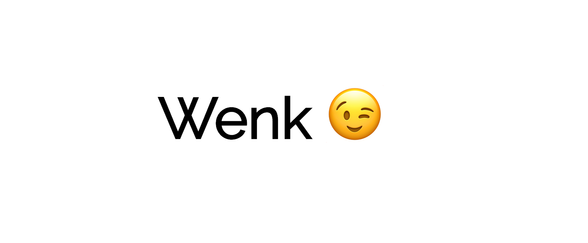
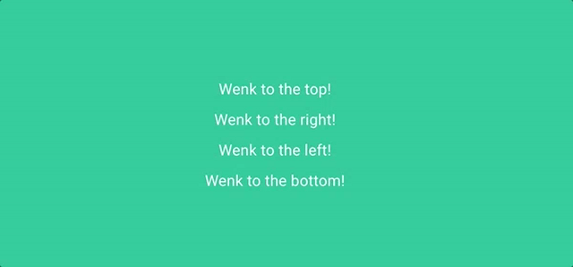

<div align="center">
	
</div>
<br>
<div align="center">
	Lightweight pure CSS tooltip for the greater good
</div>
<br>
<div align="center">
  <a href="https://npmjs.org/package/wenk">
    
  </a>
  <a href="https://npmjs.org/package/wenk">
  
  </a>
  <a href="https://github.com/feross/standard">
    
  </a>
  <a href="https://travis-ci.org/tiaanduplessis/wenk">
    
  </a>
  <a href="https://badge.fury.io/gh/tiaanduplessis%2Fwenk">
    
  </a>
  <a href="https://github.com/tiaanduplessis/wenk/blob/master/other/LICENSE">
    
  </a>
  <a href="http://makeapullrequest.com">
    
  </a>
  <a href="https://greenkeeper.io/">
    
  </a>
</div>
<br>
<div align="center">
  <a href="https://github.com/tiaanduplessis/wenk/watchers">
    
  </a>
  <a href="https://github.com/tiaanduplessis/wenk/stargazers">
    
  </a>
  <a href="https://twitter.com/intent/tweet?text=Check%20out%20wenk!%20https://github.com/tiaanduplessis/wenk%20%F0%9F%91%8D">
    
  </a>
</div>

## Table of Contents

- [About](#about)
- [As Seen in](#as-seen-in)
- [Why](#why)
- [Install](#install)
- [Usage](#usage)
  - [Touch input](#touch-input)
- [Demo](#demo)
- [Support](#support)
- [Building and testing](#building-and-testing)
- [Contributing](#contributing)
- [License](#license)


## About

**Wenk** is a Lightweight tooltip available in pure CSS, [cssnext](http://cssnext.io/) using [PostCSS](http://postcss.org/), [Less](https://raw.githubusercontent.com/tiaanduplessis/wenk/master/src/wenk.less) or [SCSS](https://raw.githubusercontent.com/tiaanduplesssis/wenk/master/src/wenk.scss).

## As Seen in

- [20 Awesome Javascript & CSS Tooltip Libraries](https://bashooka.com/coding/javascript-css-tooltip-libraries/)
- [Create Minified Tooltips in Pure CSS with Wenk](https://www.hongkiat.com/blog/pure-css-lightweight-tooltip-wenk/)

## Why

- It's Lightweight with the **minified version being only 733 bytes when gzipped** :scream:
- It's easy to use
- It's easy to customize
- It's pure CSS
- You're already here

## Install

**Install with cdn**

```html
<link rel="stylesheet" href="https://unpkg.com/wenk/dist/wenk.css">
<!-- Or -->
<link rel="stylesheet" href="https://cdn.rawgit.com/tiaanduplessis/wenk/master/dist/wenk.css">
```

**Install with npm**

```sh
$ npm install wenk
```

**Install with yarn**

```sh
$ yarn add wenk
```

## Usage

<div align="center">
	
</div>

Simply add the `data-wenk` attribute to your HTML with the text you want to display.
```html
<span data-wenk="This is a tooltip!"></span>
```

You can display the tooltip at different positions using the `data-wenk-pos` attribute or the `.wenk--*` class. The default position is at the top.
```html
<span data-wenk="I'm to the right!" data-wenk-pos="right">Wenk to the right!</span>
<span data-wenk="I'm to the left!" data-wenk-pos="left">Wenk to the left!</span>
<span data-wenk="I'm at the bottom!" data-wenk-pos="bottom">Wenk to the button!</span>
<!-- Or -->
<span class="wenk--right" data-wenk="I'm to the right!">Wenk to the right!</span>
<span class="wenk--left" data-wenk="I'm to the left!">Wenk to the left!</span>
<span class="wenk--bottom" data-wenk="I'm at the bottom!">Wenk to the button!</span>
```

The width of the tooltip can also easily be changed.
```html
<span data-wenk="I'm small!" data-wenk-length="small">Small wenk!</span>
<span data-wenk="I'm medium!" data-wenk-length="medium">Medium wenk!</span>
<span data-wenk="I'm large!" data-wenk-length="large">Large wenk!</span>
<span data-wenk="I fit!" data-wenk-length="fit">I fit just right!</span>
<!-- Or -->
<span data-wenk="I'm small!" class="wenk-length--small">Small wenk!</span>
<span data-wenk="I'm medium!" class="wenk-length--large">Medium wenk!</span>
<span data-wenk="I'm large!" class="wenk-length--large">Large wenk!</span>
<span data-wenk="I fit!" class="wenk-length--fit">I fit just right!</span>
```

You can also align your text within the container
```html
<p><span data-wenk="I'm right!" class="wenk-align--right">Wenk to the right!</span></p>
<p><span data-wenk="I'm center!" class="wenk-align--center">Wenk in the center!</span></p>
```

### Touch input

Wenk's default stylesheet uses a CSS `::after` tooltip with `pointer-events: none`
and has no built-in tap-to-dismiss handler. On touch input, a tooltip can remain
visible after a tap,
and tapping over it can activate a link or other element underneath it.

If your application prefers to hide tooltips when the primary pointing device
cannot conveniently hover or has limited accuracy, add this optional override
after Wenk's default stylesheet:

```css
@media (hover: none), (pointer: coarse) {
  [data-wenk]::after {
    opacity: 0 !important;
    visibility: hidden !important;
  }
}
```

For the material theme, also include `[data-wenk]::before` in the selector list
to hide its arrow.

This suppresses the tooltip; it does not add tap-to-dismiss or change link
behavior. The [`hover` and `pointer` media features](https://www.w3.org/TR/mediaqueries-4/#mf-interaction)
describe the primary pointing device chosen by the browser, not each individual
interaction. On hybrid touch/mouse devices, this can hide tooltips while using a
mouse or leave them enabled while using touch. Test the input combinations your
application supports.

Keep essential information available outside the tooltip, including for touch,
keyboard, and assistive-technology users. Do not rely on hover-only content for
instructions or labels.

## Demo

Check out the demo [here](https://tiaanduplessis.github.io/wenk/).

## Support

According to [doiuse.com](http://www.doiuse.com/) the following browsers are currently missing support:
- IE (8,10)
- Opera (12.1)
- Opera Mini (5.0-8.0)
- IE Mobile (10)

## Building and testing

The development tasks use Gulp 4. On Node.js 18 or newer, install the locked
Yarn 1 dependencies with lifecycle scripts disabled, then run:

```sh
yarn install --frozen-lockfile --ignore-scripts --ignore-optional
yarn lint
yarn test
yarn build
```

`build` removes only its five generated `dist/wenk.*` files, then builds them in
parallel and updates `demo/wenk.min.css`. The separately maintained
`dist/themes/material.css` and unrelated distribution files are preserved.
`dev` builds once and watches the three source formats; `start` also serves the
demo. Invalid or missing source files fail the build.

The tests use temporary directories to check task registration, cleanup,
repeatable builds, source-format preservation, build failures, watch rebuilds,
and demo setup. The demo server is mocked in tests. `lint` is a non-mutating
JavaScript syntax check.

The checked-in distributions are intentionally unchanged by the task repair.
Their old version/year banners are regenerated from the package metadata and
current year when building. The existing cssnano 4 dependency also produces
minified output that differs from the historical checked-in minified CSS: it
removes the pixel padding fallback and replaces the old rounded
`hsla(0,0%,7%,.8)` background value with the source `rgba(17,17,17,.8)` value.
The unminified CSS, CSSNext, Less, and Sass bodies are unchanged.
Review browser compatibility before publishing regenerated minified files.

The Yarn lock updates the legacy optional macOS watcher to
`fsevents@1.2.13`, avoiding the malware-affected versions in the previous lock.
Native macOS watcher execution is not covered by the portable test suite.

These changes do not modernize the complete legacy development dependency
stack. Known vulnerabilities remain; do not expose the development server to
untrusted networks or process untrusted stylesheets. No release or deployment
is performed by the build or test commands.

## Contributing

All Contributions are welcome! Please open up an issue if you would like to help out. :smile:

## License

Licensed under the MIT License.
